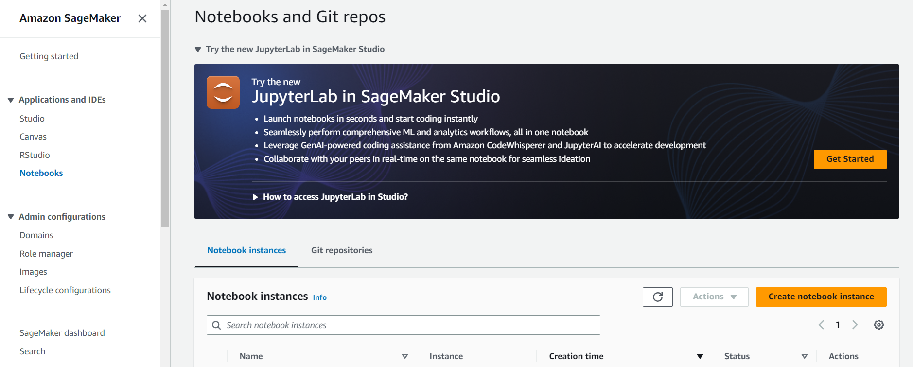
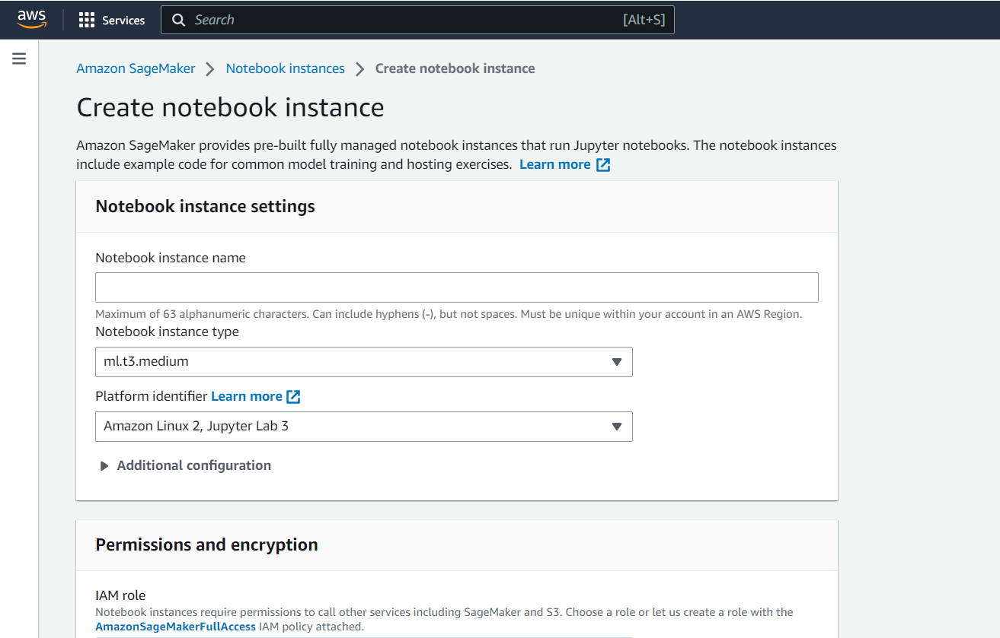

# Hi! PARIS Summer School 2024 - Exploring Machine Learning Deployment from beginner to advance level 🚀


This repository contains the demos for the **Hi! PARIS Summer School 2024** session on **Exploring Machine Learning Deployment from beginner to advance level** 🚀.

The repository contains three folders, one for each practical demo:
- `streamlit-app/` for the Streamlit demo
- `sagemaker-deployment/` for the AWS SageMaker demo
- `docker-app/` for the Docker + AWS Lambda demo 

<br>

The session was hosted by  **Awais SANI**, Senior Machine Learning engineer @ Hi! PARIS and **Laurène DAVID**, Machine Learning engineer @ Hi! PARIS.

To learn more about the Hi! PARIS Engineering Team, here are some useful links:
- Github: https://github.com/hi-paris
- Website: https://engineeringteam.hi-paris.fr/

<br> 

## Demo 1: Deploy a Sentiment Analysis app using Streamlit 


### <u>1. Streamlit tutorials</u>
- Deploy a Streamlit app: https://docs.streamlit.io/deploy/streamlit-community-cloud/deploy-your-app
- Manage streamlit secrets: https://docs.streamlit.io/deploy/streamlit-community-cloud/deploy-your-app/secrets-management
- Connect app to external data sources: https://docs.streamlit.io/develop/tutorials/databases
- Deploy to HuggingFace spaces: https://medium.com/@imanuelyosi/deploy-your-streamlit-web-app-using-hugging-face-7b9cddb11148
<br>

### <u>2. Useful commands</u>

Launch a streamlit app locally <br>
```python 
streamlit run app.py
```
<br>

Build a `requirments.txt` file for deployment
```python
pip3 freeze > requirements.txt
```
<br>
<br>

## Demo 2: Deploy pre-trained sklearn models with AWS SageMaker 

### <u>1. How to launch a SageMaker notebook instance</u> 

#### Step 1: Create an AWS account
First, you will need to create an AWS account if you don't already have one. <br>
https://aws.amazon.com/?nc1=h_ls

#### Step 2: Go to the Amazon SageMaker console and create a notebook instance.


Go to the Amazon SageMaker console and select the Notebooks option on the console's left tab.
To create the notebook, click on **Create notebook instance**.

#### Step 3: Configure the SageMaker notebook instance.



Most of the following fields can be left with their default value, except the configuration of an IAM role. This IAM role will enable access the notebook's S3 bucket to store data/models.


- Select a *notebook instance name*
- Select a *notebook instance type* (the default value is the least expensive option)
- Select a *platform type* for the notebook instance, for example the JupyterLab version you want to use (can be left at default)
- For the IAM role, click on *Create a new role option* then create a row for the notebook.

#### Step 5: Launch the notebook instance 
Once you've provided all the required information, you can now launch the notebook (this can take a couple of minutes). To stop the instance from running, click on the notebook instance then select *Stop*. This will be prevent additional costs.


### <u>2. Deploy a pre-trained model with SageMaker</u>
The `sagemaker-deployment/ss2024_AWS_deployment.ipynb` notebook contains detailed steps to deploy a pre-trained sklearn model to AWS SageMaker.  


